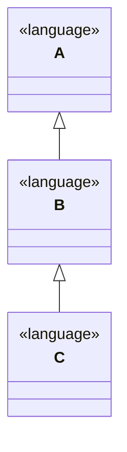

# MPS API Gen

## Deprecation note

⚠ This component will soon™ be replaced by a version 2.0 ⚠

If you plan on using the api-gen, consider directly using the new version at
(metamodel-generator)[https://github.com/modelix/modelix.core/tree/main/metamodel-generator] to avoid migration later on.
For convenience there is also a gradle plugin to help you generate MPS -> metamodel API available: (metamodel-gradle)[https://github.com/modelix/modelix.core/tree/main/metamodel-gradle]


## General

MPS API Gen is code generator and runtime library that allows to export MPS metamodels into Java classes that provide a
type safe wrapper around the modelix model api. The generated code is completely independent of MPS. The generated code
can work with any implementation of the modelix model api, e.g. the modelix model server/client, mps-rest-model-access
or
directly within MPS via modelix model adapters.

The goal of this project is to allow working with instances of MPS metamodels outside of MPS and without deep knowledge
of
metamodelling. The generated code tries to represent as many aspects of the metamodel in a "Java native" way as
possible.

## Features

### Concept and Interface Export

All concept and interface declarations within the structure aspect of a language are exported into Java code.
Concepts will get represented as Java classes and interfaces as Java interfaces. Each property, child or references role
is generated into a getter and setter.

Since MPS allows the same name for a property and a child/reference role the code generator needs to deconflict these.
Therefor the getter and setters aren't directly part of the class represented a concept but the Java class/interface
container three getters, one for properties, children and references. The return value of these getters is then a
concept
specific class representing the properties, children or references. This means when consuming the generated some
knowledge
about the nature of the data is required upfront.

The classes for properties, children and references are generated as inner classes to the class generated for
the concept/interface.

The inheritance hierarchy of classes and implements hierarchy of interfaces in MPS is represented the exact same way in
the generated code.

A `instanceof` check in Java will work as expected. E.g. A concept `Room` which implements the `INamedConcept` interface
in MPS will also implement it in Java.

#### Example

A concept like this:

```
concept Room extends BaseConcept
             implements INamedConcept

instance can be root: false
alias: <no alias>
short description: <no short description>

properties:
maxPlaces : integer
hasRemoteEquipment : boolean

children:
<< ... >>

references:
<< ... >>
```

<details>
<summary>
In generated into the following Java class:
</summary>

```java
package University.Schedule.structure;

/*Generated by MPS */

import jetbrains.mps.lang.core.structure.BaseConcept;
import jetbrains.mps.lang.core.structure.INamedConcept;
import org.modelix.mps.apigen.runtime.INodeHolder;
import org.jetbrains.annotations.NotNull;
import org.modelix.model.api.INode;
import org.jetbrains.annotations.Nullable;

/**
 * Generated for http://127.0.0.1:63320/node?ref=r%3Adfa26643-4653-44bc-9dfe-5a6581bcd381%28University.Schedule.structure%29%2F4128798754188010580
 */
public class Room extends BaseConcept implements INamedConcept {

    public class Properties extends BaseConcept.Properties implements INodeHolder, INamedConcept.Properties {

        @NotNull
        @Override
        public INode getINode() {
            return Room.this.getINode();
        }

        @Nullable
        public Integer getMaxPlaces() {
            String propertyValue = getINode().getPropertyValue("maxPlaces");
            if (propertyValue != null && !(propertyValue.isEmpty())) {
                return Integer.parseInt(propertyValue);
            }
            return null;
        }

        @Nullable
        public Integer setMaxPlaces(Integer value) {
            if (value != null) {
                getINode().setPropertyValue("maxPlaces", Integer.toString(value));
            } else {
                getINode().setPropertyValue("maxPlaces", null);
            }
            return value;
        }

        @Nullable
        public Boolean getHasRemoteEquipment() {
            String propertyValue = getINode().getPropertyValue("hasRemoteEquipment");
            if (propertyValue != null && !(propertyValue.isEmpty())) {
                return Boolean.parseBoolean(propertyValue);
            }
            return null;
        }

        @Nullable
        public Boolean setHasRemoteEquipment(@Nullable Boolean value) {
            if (value != null) {
                getINode().setPropertyValue("hasRemoteEquipment", Boolean.toString(value));
            } else {
                getINode().setPropertyValue("hasRemoteEquipment", null);
            }
            return value;
        }
    }

    public class Children extends BaseConcept.Children implements INodeHolder, INamedConcept.Children {

        @NotNull
        @Override
        public INode getINode() {
            return Room.this.getINode();
        }
    }

    public class References extends BaseConcept.References implements INodeHolder, INamedConcept.References {

        @NotNull
        @Override
        public INode getINode() {
            return Room.this.getINode();
        }


    }

    private final Properties properties;
    private final Children children;
    private final References references;

    public Room(INode node) {
        super(node);
        this.properties = new Properties();
        this.children = new Children();
        this.references = new References();
    }

    public Properties getProperties() {
        return this.properties;
    }

    public Children getChildren() {
        return this.children;
    }

    public References getReferences() {
        return this.references;
    }
}

```

</details>

### Language Registry

The essential component to provide the mapping from `INode` instances to the generated code is the `MPSLanguageRegistry`
class. As the name suggests the class holds a registry of all generated languages and their concepts. Each language that
is generated will result in a class that extends `MPSLanguage`. This generated class provides information about the
language
like all concepts contain in it. In order for the language registry to know about a language the language class
needs to be registered. The code generator emits a singleton for each generated language that you can register like
this:

```kotlin
MPSLanguageRegistry.register(jetbrains_mps_lang_core.INSTANCE)
```

The language registry itself acts as a `IConceptReferenceSerializer` and needs registering as well:

```kotlin
IConceptReferenceSerializer.register(MPSLanguageRegistry())
```

### Language Hierarchy

The code generator will automatically take language hierarchy into account when exporting concepts.



In case you are specifying language `C` to be exported the code generator will also export `B` and `A` because it
analyses
the extends relationships within MPS.

## How to use the generated code

A minimum example on how to use the generated code would look like this:

```kotlin

fun getRoot(): List<INode> {
    /*
      The implementation of the get roots method will depend on the type of
      modelix API client you use and isn't part of the example.
    */
}

MPSLanguageRegistry.register(jetbrains_mps_lang_core.INSTANCE)
IConceptReferenceSerializer.register(MPSLanguageRegistry())


val roots = getRoots()

// Create instances of the generated classed via MPSLanguageRegistry.
val baseConcepts = roots.map { iNode -> MPSLanguageRegistry.getInstance<BaseConcept>(iNode) }

```

## Limitations

### Specializations

MPS allows to specialize children of a super concept. When specialising a child, renaming and type specialisation is
allowed.
Unfortunately MPS allows a child with the type `BaseConcept` to be specialized with an Interface without error. This
seems
to be a bug in MPS. Since the code generator will export `BaseConcept` into a Java class but an Interface into a Java
interface the generated code for the specialized child will not compile. The Java compiler will complain that the
overriding
type is not compatible withe overridden method.

The code generator does not detect these cases automatically during generation, you will only get a error message
from the Java compiler when compiling the generated code. In this case you need to fix your language definition because
there is no workaround we can apply automatically during generation.

### Java Instantiation

The `MPSLanguageRegistry` will return a separate instance each time `getInstance` is called when the same `INode`
instance
is passed to it. Code cannot assume that two called to `getInstance` with the same `INode` instance return the same
instance
of the generated Java class. But the `AbstractNode` base class for all generated classed implements `equals` the way
that it compares the underlying `INode` instance. Hence, a "structural" equals behaves as desired:

```kotlin
val iNode: INode = null

val nodeA = MPSLanguageRegistry.getInstance<AbstractNode>(iNode)
val nodeB = MPSLanguageRegistry.getInstance<AbstractNode>(iNode)


nodeA === nodeB // false
nodeA == nodeB // true

```

Since both node instances share the same `INode` they will still behave as if they are the same node when it comes to
accessing information on them:

```kotlin
nodeA.name = "John"
nodeA.name == nodeB.name //true
```

Depending on how the actual model implementation chooses to implement the `INode` interface it might result in two
independent
`INode` instances to be considered equal. In that case also the `AbstractNode` instances returned
by `MPSLanguageRegistry.getInstance`
will be considered equal even if the point to two different `INode` instances. e.g. the "modelix/rest-model-access"
client
chooses to implement their `INode` instances that way because the client acts as a proxy to a node stored inside of MPS.


